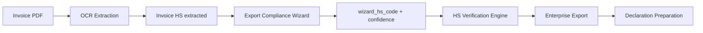

# HS Verification Engine — Review

## Purpose

The HS Verification Engine compares **invoice-extracted HS codes** against **Export Compliance Wizard classification** to detect discrepancies and classification risk. It is a **verification and risk-detection layer only** — it never replaces invoice HS codes automatically.

## Architecture



### Pipeline placement

| Stage | Module | Role |
|-------|--------|------|
| HS extraction | `hs-classification-workflow.ts` | Resolves invoice vs final HS, status/source |
| Verification | `hs-verification-engine.ts` | Compares invoice HS vs wizard HS |
| Mapping | `map-api-response.ts` | Builds `hsVerificationSummary`, enriches traceability |
| Readiness | `customs-readiness-engine.ts` | Downgrades to CUSTOMS_REVIEW on high-confidence mismatch |
| Export | `mrn-export.ts` | Verification columns in CSV/Excel |
| UI | `HsVerificationSection.tsx` | Line-level verification card |

### Data contract (`ApiInvoiceItem`)

Wizard results arrive on invoice items before mapping — the platform does not call the wizard directly during audit mapping:

| Field | Purpose |
|-------|---------|
| `invoice_hs_code` / `hs_code` | Invoice-printed HS |
| `final_hs_code` | Declaration HS (user/wizard acceptance only) |
| `wizard_hs_code` | Wizard suggestion for **verification display only** |
| `wizard_confidence` | Wizard confidence 0–100 |
| `similarity_score` | Optional description/classification similarity 0–100 |

**Critical rule:** `wizard_hs_code` is never copied into `final_hs_code` by the verification engine.

## Entity: `HsVerificationResult`

| Field | Description |
|-------|-------------|
| `invoice_hs_code` | HS from invoice |
| `wizard_hs_code` | HS from Export Compliance Wizard |
| `verification_status` | See status rules below |
| `wizard_confidence` | Wizard confidence (%) |
| `similarity_score` | Description/HS similarity (%) |
| `verification_reason` | Human-readable explanation |

### Verification statuses

| Status | Meaning |
|--------|---------|
| `VERIFIED` | Invoice and wizard agree, or same chapter/subheading with sufficient similarity |
| `REVIEW_REQUIRED` | Different HS codes with wizard confidence ≥ threshold |
| `REVIEW_REQUIRED_LOW_CONFIDENCE` | Different HS codes but wizard confidence below threshold |
| `GENERATED` | No invoice HS; wizard classification available |
| `MISSING` | No invoice HS and wizard not run |

## Business rules

### 1. VERIFIED

- Invoice HS and wizard HS are identical, **or**
- Same HS chapter/subheading **and** `similarity_score ≥ HS_VERIFICATION_SIMILARITY_THRESHOLD` (default 95%)

Example: Invoice `73072980`, Wizard `73072980` → **VERIFIED**

### 2. REVIEW_REQUIRED

- Invoice HS exists
- Wizard HS exists and differs
- `wizard_confidence ≥ HS_VERIFICATION_CONFIDENCE_THRESHOLD` (default 80%)

Example: Invoice `39269097`, Wizard `84818081`, confidence 94% → **REVIEW_REQUIRED**

### 3. GENERATED

- Invoice HS missing
- Wizard HS available

Example: Invoice —, Wizard `76169990`, confidence 89% → **GENERATED**

### 4. MISSING

- Invoice HS missing
- Wizard not run

### 5. REVIEW_REQUIRED_LOW_CONFIDENCE

- Invoice and wizard differ
- `wizard_confidence < HS_VERIFICATION_CONFIDENCE_THRESHOLD`

Example: confidence 62% → **REVIEW_REQUIRED_LOW_CONFIDENCE** — flagged in UI/export but **does not** downgrade customs readiness.

## Customs readiness impact

| Condition | Result |
|-----------|--------|
| `REVIEW_REQUIRED` (confidence ≥ 80%) | **CUSTOMS_REVIEW** — reason: *HS classification discrepancy detected* |
| `REVIEW_REQUIRED_LOW_CONFIDENCE` | No readiness downgrade |
| `VERIFIED` / `GENERATED` (with final HS) | No verification-driven downgrade |
| `MISSING` | Existing HS workflow rules apply (`CUSTOMS_REVIEW` when no HS at all) |

Verification integrates with — but does not replace — the existing `hsWorkflowSummary.documentHsStatus` logic.

## Enterprise export columns

Declaration preparation export (`MRN_EXPORT_COLUMNS`) includes:

- Invoice HS
- Wizard HS
- HS Verification Status
- Wizard Confidence
- Verification Reason

Traceability sheet adds the same fields per invoice position alongside Final HS and HS Source.

## UI

**HS Verification** card (Classification + Enterprise tabs):

- Position, Invoice HS, Wizard HS, Status badge, Confidence, Reason
- Status labels: Verified, Review Required, Generated, Missing

Aggregation traceability tables show verification columns at HS and position level.

## Configuration

| Environment variable | Default | Purpose |
|---------------------|---------|---------|
| `HS_VERIFICATION_CONFIDENCE_THRESHOLD` | 80 | Minimum wizard confidence (%) to trigger high-confidence review |
| `HS_VERIFICATION_SIMILARITY_THRESHOLD` | 95 | Minimum similarity (%) for chapter/subheading match → VERIFIED |

Defined in `hs-verification-config.ts`.

## No automatic override

The verification engine:

- **Does not** modify `hs_code`, `invoice_hs_code`, or `final_hs_code`
- **Does not** set `hs_source` to WIZARD
- **Only** flags discrepancies and suggests review

Final HS may change only through:

- Explicit user override (`hs_source: USER`)
- Wizard acceptance workflow (upstream sets `final_hs_code`)
- Import pipeline (`hs_source: IMPORTED`)

## Future Wizard integration

1. **OCR pass** extracts invoice lines and invoice HS where present.
2. **Export Compliance Wizard** classifies each goods line and returns `wizard_hs_code`, `wizard_confidence`, and optional `similarity_score` on each item.
3. **HS Verification Engine** runs during `mapAuditReportToExportReport` — no wizard callback in the platform layer today.
4. **User acceptance** (future UI): user confirms wizard HS → upstream sets `final_hs_code` + `hs_source: WIZARD` — separate from verification.
5. **Declaration preparation** uses `final_hs_code` for aggregation; verification columns remain for audit trail.

Target outcome: OCR + Wizard together produce a declaration-ready dataset even when invoices contain no HS codes, while invoice HS discrepancies are surfaced before declaration filing.

## Regression tests

Run: `npm run test:hs-verification`

| Scenario | Expected |
|----------|----------|
| Invoice HS = Wizard HS | VERIFIED |
| Different HS, confidence 94% | REVIEW_REQUIRED + CUSTOMS_REVIEW |
| Invoice HS missing, wizard available | GENERATED |
| Invoice HS missing, wizard not run | MISSING |
| Different HS, confidence 62% | REVIEW_REQUIRED_LOW_CONFIDENCE, CUSTOMS_READY unchanged |

Also covered in `test:golden-customs-workflow` and `test:mrn-export`.

## Key files

```
src/lib/export-auditor/
  hs-verification-config.ts
  hs-verification-engine.ts
  customs-readiness-engine.ts
  map-api-response.ts
  mrn-export.ts
  types.ts
  api-types.ts

src/components/export-auditor/results/
  HsVerificationSection.tsx
  HsAggregationTraceabilityTable.tsx

scripts/test-hs-verification.ts
```
