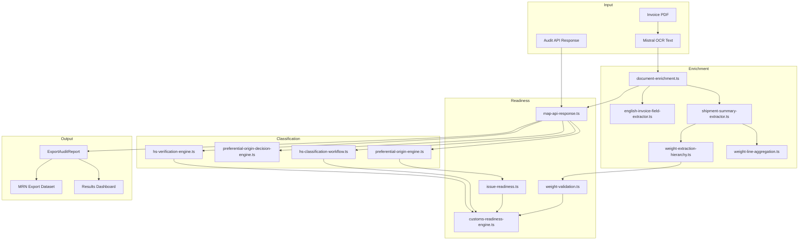

# Production Hardening Report — Export Auditor

Date: 2026-06-13  
Scope: Full production hardening pass based on real invoice validation results (AS2026-1069, HENN, Häfele, Klintek, HS Wizard)

---

## Executive Summary

Six critical production defects were hardened with new weight hierarchy rules, English OCR recovery, position-specific preferential origin, legacy issue suppression, customs readiness consistency guards, and HS Wizard data-model support. All regression suites pass.

---

## PASS / FAIL Table

| Test Suite | Result | Count |
|------------|--------|-------|
| `npm run test:production-defect-fixes` | **PASS** | 47/47 |
| `npm run test:golden-customs-workflow` | **PASS** | 41/41 |
| `npm run test:hs-verification` | **PASS** | 18/18 |
| `npm run test:mrn-export` | **PASS** | 84/84 |
| `npx next build` | **PASS** | TypeScript + lint clean (1 pre-existing ESLint warning) |

---

## Critical Fix #1 — Shipment Weight Hierarchy

### Real invoice evidence (Klintek)
- Document gross: **1574 kg**
- Stale calculated net: **11060 kg** (unit weights × qty summed as shipment net)
- Line unit nets: 200 kg × 40 + 300 kg × 30 → unrealistic vs gross

### Before
| Field | Value | Source |
|-------|-------|--------|
| Gross | 1574 kg | Document |
| Net | 11060 kg | CALCULATED (unit-weight misuse) |
| Warning | None | — |
| Customs readiness | Could reach CUSTOMS_READY | — |

### After
| Field | Value | Source | Type |
|-------|-------|--------|------|
| Gross | 1574 kg | DOCUMENT | SHIPMENT |
| Net | **null (UNKNOWN)** | — | — |
| Warning | "Detected unit-level weights. Shipment net weight requires recalculation." | UNIT_WEIGHT_MISUSE | — |
| Customs readiness | CUSTOMS_BLOCKED / REVIEW (not READY) | — | — |

### Implementation
1. Document shipment net → authoritative (`SHIPMENT` / `DOCUMENT|OCR_TEXT|OCR_TABLE`)
2. Document gross only → net **UNKNOWN** (never copy gross into net)
3. No document weights → sum **line totals** (`LINE` / `CALCULATED`)
4. Never treat raw unit net as shipment net
5. Net > gross (both document-level) → `CUSTOMS_REVIEW` — "Net weight exceeds gross weight"
6. Calculated line sum > gross by >10% → unit-weight misuse warning

### Key files
- `weight-extraction-hierarchy.ts` — priority resolver + `WeightType`
- `weight-line-aggregation.ts` — qty-aware line aggregation + misuse detection
- `weight-validation.ts` — plausibility checks
- `shipment-readiness.ts` — warning emission
- `customs-readiness-engine.ts` — review/block integration

---

## Critical Fix #2 — AS2026-1069 English Invoice Extraction

### Real invoice evidence
| Field | OCR content |
|-------|-------------|
| Invoice # | AS2026-1069 |
| Exporter | Apecs.S d.o.o. |
| Consignee | Braca Maric |
| Value | 21,790.30 EUR |
| Lines | 3 Pos-table rows |

### Before
| Metric | Value |
|--------|-------|
| Lines extracted | 0 |
| Value | 0 EUR |
| Exporter | missing |
| Consignee | missing |
| Completeness | 0% |
| Parser failure | PARSER_MAPPING_FAILURE |

### After
| Metric | Value |
|--------|-------|
| Lines extracted | **3** |
| Value | **21,790.30 EUR** |
| Exporter | **Apecs.S d.o.o.** |
| Consignee | **Braca Maric** |
| Completeness | **≥ 80%** |
| Parser failure | **suppressed** |

### Key files
- `english-invoice-field-extractor.ts` — Invoice #, Buyer, Recipient, totals, Pos table, EUR currency
- `document-enrichment.ts` — OCR recovery pipeline
- `ocr-observability.ts` — header 60% + lines 40% completeness

---

## Critical Fix #3 — Häfele Preferential Origin

### Real invoice evidence
Declaration: "Positions **5, 6, 8, 11, 12 and 16** are of preferential origin."

### Before
| Positions | Preferential |
|-----------|--------------|
| 5,6,8,11,12,16 | YES (if matched) |
| All others | YES (blanket override) |

### After
| Positions | Preferential |
|-----------|--------------|
| 5, 6, 8, 11, 12, 16 | **YES** |
| 1–4, 7, 9–10, 13–15, 17 | **UNKNOWN / NOT_DECLARED** |

### Implementation
- `parsePositionNumbers()` — comma lists + ranges (`5-8`)
- `blanketAllYes = false` when `explicitYes.size > 0`

---

## Critical Fix #4 — HENN Legacy Logic

### Real invoice evidence
- Authorised exporter: **AT/920/038**
- EU origin declaration present

### Before
| Issue | Present |
|-------|---------|
| EUR1_RECOMMENDED | Yes |
| NO_AUTHORISED_EXPORTER | Yes |
| evidenceStatus | UNVERIFIED |

### After
| Issue | Present |
|-------|---------|
| EUR1_RECOMMENDED | **Removed** |
| NO_AUTHORISED_EXPORTER | **Removed** |
| evidenceStatus | **DECLARED** |
| Line preferential | **YES** |

### Implementation
- `filterSupersededPreferentialAuditIssues()` — filters when `DECLARED` or auth+declaration detected
- `preferential-origin-engine.ts` — auth + declaration → line YES

---

## Critical Fix #5 — Customs Readiness Consistency

`CUSTOMS_READY` no longer coexists with:

| Contradiction | Guard |
|---------------|-------|
| Critical extraction failure | `PARSER_MAPPING_FAILURE` → CUSTOMS_BLOCKED |
| Impossible shipment weights | Net > gross → CUSTOMS_REVIEW |
| Unit-weight misuse | Blocks CUSTOMS_READY on Klintek-class invoices |
| Mixed preferential origin | `MIXED_ORIGIN` → CUSTOMS_REVIEW |
| Low extraction completeness | <50% → CUSTOMS_REVIEW |
| HS discrepancy (high confidence) | REVIEW_REQUIRED → CUSTOMS_REVIEW |

---

## Critical Fix #6 — HS Wizard Support

Each line supports:

| Field | Values |
|-------|--------|
| `invoice_hs_code` | Invoice-printed HS |
| `wizard_hs_code` | Wizard suggestion (verification only) |
| `final_hs_code` | Declaration HS |
| `hs_source` | INVOICE \| WIZARD \| USER \| IMPORTED |
| `hs_verification_status` | VERIFIED \| REVIEW_REQUIRED \| REVIEW_REQUIRED_LOW_CONFIDENCE \| GENERATED \| MISSING |

### Wizard-only HS (no invoice HS)
| Before | After |
|--------|-------|
| documentHsStatus MISSING → CUSTOMS_REVIEW | documentHsStatus **GENERATED** → **CUSTOMS_READY** |
| Missing HS codes reason | Wizard HS satisfies readiness |

### Key files
- `hs-classification-workflow.ts` — `resolveFinalHsCodeForItem()` uses wizard when invoice HS absent
- `hs-verification-engine.ts` — comparison layer (never overrides invoice HS)
- `customs-readiness-engine.ts` — `hasHsForCustomsReady()` respects GENERATED status

---

## Updated Architecture Diagram



---

## Remaining Production Risks

| Risk | Severity | Mitigation path |
|------|----------|-----------------|
| Pos-table regex brittleness on non-standard layouts | Medium | Add golden OCR fixtures per supplier; extend column-aware parser |
| `OCR_TABLE` source not yet assigned from tabular extractor | Low | Wire `tabular-shipment-extractor.ts` to set source |
| Häfele position ranges in non-English declarations | Low | Extend multilingual position patterns |
| AS2026 fixture is synthetic OCR, not live Mistral output | Medium | Capture `scripts/fixtures/as2026-1069-ocr.json` from production |
| Wizard HS acceptance UX not built | Medium | UI flow to accept wizard → `final_hs_code` + `hs_source: WIZARD` |
| Net weight UNKNOWN when only gross on invoice | Info | Expected behaviour — user must supply net or accept review |
| Mixed origin YES + NOT_DECLARED (not YES + NO) | Low | Document status may show CONFIRMED; line-level status is authoritative |

---

## Verification Commands

```bash
npm run test:production-defect-fixes
npm run test:golden-customs-workflow
npm run test:hs-verification
npm run test:mrn-export
npx next build
```

---

## New / Modified Files

```
src/lib/export-auditor/
  weight-extraction-hierarchy.ts      (rewritten hierarchy)
  weight-line-aggregation.ts          (NEW)
  weight-validation.ts              (NEW)
  english-invoice-field-extractor.ts  (enhanced AS2026)
  shipment-summary-extractor.ts       (line aggregation + source preservation)
  preferential-origin-engine.ts     (position ranges)
  issue-readiness.ts                  (HENN legacy filter)
  customs-readiness-engine.ts         (consistency guards)
  hs-classification-workflow.ts       (wizard HS gap fill)
  shipment-readiness.ts               (weight warnings)
  map-api-response.ts                 (weight types)
  api-types.ts / types.ts             (WeightType fields)

scripts/test-production-defect-fixes.ts  (47 assertions)
scripts/test-hs-verification.ts          (wizard CUSTOMS_READY)
PRODUCTION_HARDENING_REPORT.md             (this file)
```
